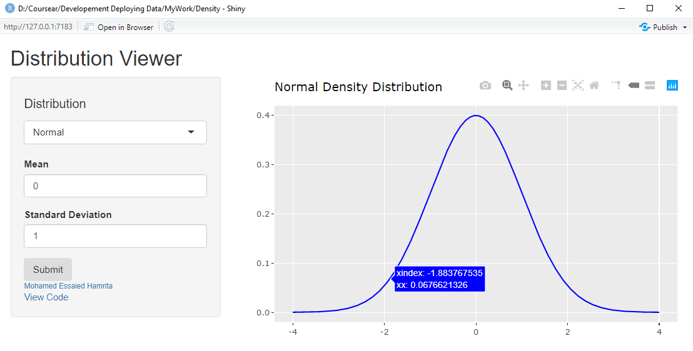
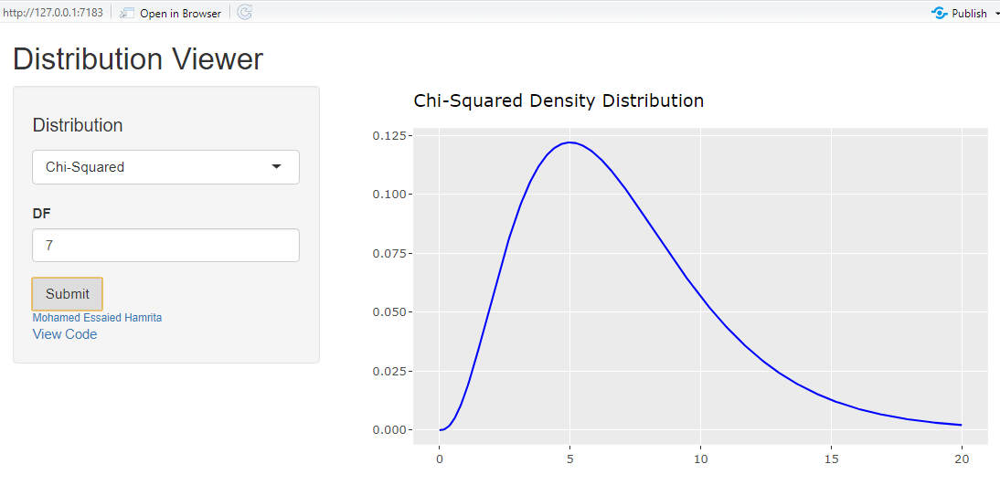

```{r setup, include=FALSE}
knitr::opts_chunk$set(echo = FALSE)
```

## About the Course Project

This is a report for the project of the course Development of data products within the framework of the Coursera Data Science specialization.

## Instructions:

1. Write a shiny application with associated supporting documentation. The documentation should be thought of as whatever a user will need to get started using your application.
2. Deploy the application on Rstudio's shiny server
3. Share the application link by pasting it into the provided text box
4. Share your server.R and ui.R code on github

## The app description

The app provides an intutive and comprehensive visualization of some continuous distribution such as Normal, Student's t, Chi-Squared, Exponential and Fisher.

## How to use the application

When the app first renders, the user is shown by default the standard normal distribution. The user may vary the both the distribution and parameters corresponding to the distribution of their choice from the options at the top under "Distribution" and clic "Submit".

## The app in action
Here, we show the app in action with two distributions.

<center>
{width=60%}  {width=60%}
</center>


